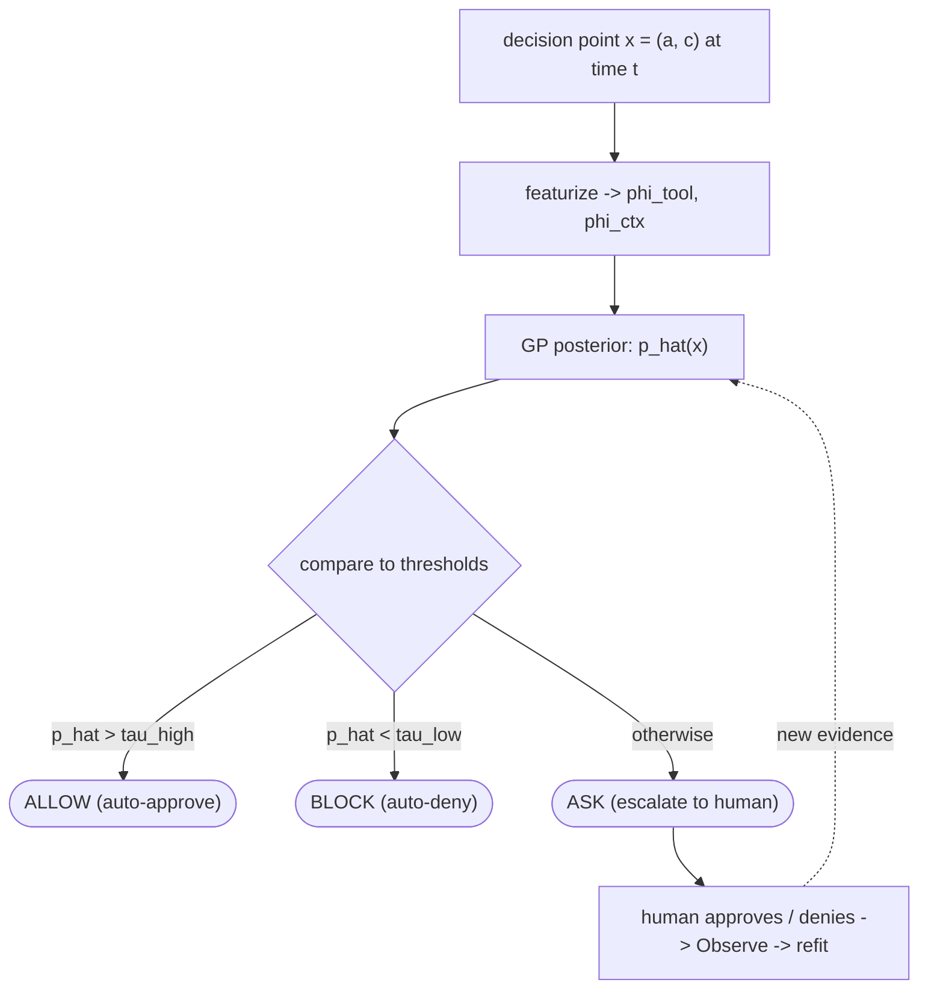
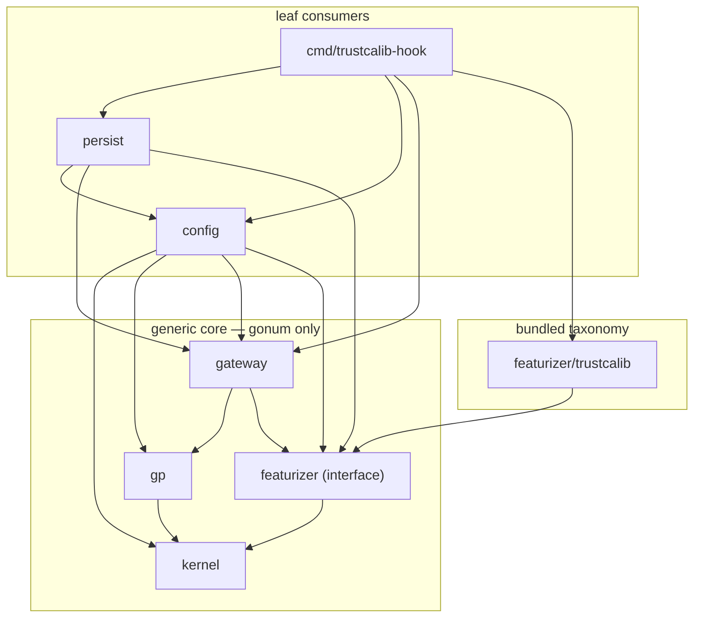
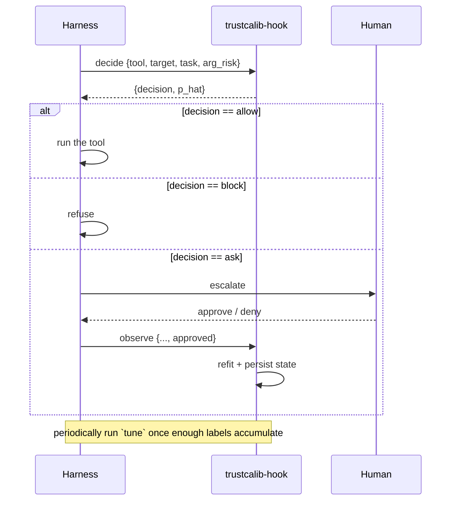

# trustcalib (Go)

A Go implementation of the trustcalib **policy gateway**: an online, three-tier
**allow / ask / block** decision layer for agentic tool use. It maintains a
Gaussian-process posterior over a latent human *risk-tolerance* function,
observes that function through probit approve/deny feedback, and escalates to a
human exactly where the approval outcome is most uncertain.

This module is the reusable core of the
[trustcalib manuscript](../manuscript) ported out of the Python simulation
(`../experiment`) and packaged as a library plus a thin CLI hook, so a real
agent harness (for example a Claude Code `PreToolUse` hook) can gate live tool
calls and learn the escalation threshold from the supervisor's own history
instead of a hand-written rule.

> The Python oracle, synthetic stream generator and evaluation/figure code are
> **not** ported — they are simulation scaffolding. In a real deployment the
> approve/deny labels come from the human, not an oracle.

## Contents

- [Concepts](#concepts)
- [Architecture](#architecture)
- [The algorithm](#the-algorithm)
- [Library usage](#library-usage)
- [CLI hook](#cli-hook)
- [Configuration](#configuration)
- [Persistence](#persistence)
- [Testing and validation](#testing-and-validation)

## Concepts

Each proposed tool call is a **decision point** `x = (a, c)` arriving at time
`t`: an action `a` (the tool and its risk attributes) in a context `c` (the
target resource, task, and whether a destructive argument is present). A
**featurizer** maps it to two feature blocks (`phi_tool`, `phi_ctx`) plus the
time `t`.

The gateway predicts an **approval probability** `p_hat(x)` and applies a
three-tier rule:



Only **ASK** points are shown to the human; their approve/deny answers become
training labels. `ALLOW`/`BLOCK` are auto-decided at zero human cost. The model
refits online as labels accumulate, and the thresholds `(tau_low, tau_high)`
are tuned from the collected `(p_hat, human-label)` history.

## Architecture

```
go/
  kernel/                 generic core: structured product kernel (stateless)
  gp/                     generic core: Laplace GP-probit classifier
  gateway/                generic core: three-tier policy + online loop + tuning
  featurizer/             pluggable Featurizer interface (Point -> FeatureVec, Pack)
    trustcalib/           bundled default: manuscript tool/target/task taxonomy
  config/                 YAML hyperparameter loader -> kernel/model/gateway
  persist/                atomic JSON state, refit-on-load (for the CLI hook)
  cmd/trustcalib-hook/    CLI: decide / observe / tune / stats
  internal/testutil/      golden-fixture loaders (tests only)
  testdata/
    fixtures/*.json       golden outputs exported from the Python reference
    gen/export_fixtures.py  regenerates the fixtures
```

**Dependency direction.** `kernel`, `gp` and `gateway` depend only on
[gonum](https://gonum.org) and the `featurizer` *types* — never on the concrete
taxonomy. The taxonomy lives only in `featurizer/trustcalib`; a harness that
wants its own action/context space implements `featurizer.Featurizer` and never
imports it. `config`, `persist` and `cmd` are leaf consumers.

Arrows point from a package to the packages it imports:



## The algorithm

### Structured product kernel (`kernel`)

Similarity between two decision points factorizes over action, context and time
(manuscript Section 4):

```
k(x, x') = sigma2 * k_tool(a, a') * k_ctx(c, c') * k_time(t, t')
```

- `k_tool`, `k_ctx` are squared-exponential (RBF) kernels over the tool and
  context feature blocks, with lengthscales `l_tool`, `l_ctx`.
- `k_time(t, t') = exp(-|t - t'| / lambda)` is the Ornstein-Uhlenbeck covariance
  that down-weights stale evidence (Section 6 non-stationarity).

The product of PSD kernels is PSD (Schur product); each block's self-similarity
is 1, so the prior variance on the diagonal is exactly `sigma2`. The kernel is
stateless and works on raw feature vectors via `Packed` (dense `phi_tool`,
`phi_ctx` matrices and a time slice).

### Laplace GP-probit classifier (`gp`)

A direct port of `experiment/gp.py` (Rasmussen & Williams 2006, Algorithms
3.1/3.2) for the probit likelihood with labels in `{-1, +1}`:

```
log p(y|f) = log Phi(y f)
d/df log p = y * phi(z)/Phi(z)              (Mills ratio, z = y f)
W          = (phi/Phi)^2 + z*(phi/Phi)      (Hessian diagonal, >= 0)
```

- **Fit** (`Fit`) finds the posterior mode by a Newton iteration. Each step
  builds `B = I + W^{1/2} K W^{1/2}` (SPD by construction), Cholesky-factorizes
  it, and solves for the update; it stops when the objective stops changing.
- **Predict** (`Predict`/`PredictProb`) returns the latent mean/variance and the
  approval probability `pi = Phi(f_bar / sqrt(1 + var))` (probit-Gaussian
  convolution).

Two numerical details matter and are tested explicitly:

- The Mills ratio is evaluated as `exp(logPDF(z) - logCDF(z))`, with a
  **stable `logCDF`** (`gp/probit.go`) that uses `log1p`/`erfc` near zero and an
  asymptotic tail series below `z = -37`, so it stays finite where
  `log(CDF(z))` would underflow to `-Inf` (matches scipy's `log_ndtr` down to
  `z = -40`).
- The predictive variance reduction is computed as `Mᵀ B⁻¹ M` (via the stored
  Cholesky factor), algebraically equal to R&W's `‖L⁻¹ M‖²` forward-solve.

Linear algebra (Cholesky, solves, matrix-vector products) uses
`gonum.org/v1/gonum/mat`; the normal CDF uses `math.Erfc`.

### Gateway: online policy + acquisition (`gateway`)

`gateway.Gateway` is the online, stateful redesign of the Python batch loop:

- `Decide(point)` returns `(Decision, p_hat)` **without** recording a label;
  on cold start (unfitted) or an unknown point it fails safe to `Ask` at 0.5.
- `Observe(point, approved)` appends a labelled training point, and refits the
  model every `RefitEvery` new labels (and as soon as two labels exist).
- `Tune()` recomputes `(tau_low, tau_high)` from the collected
  `(p_hat, label)` history; below `MinTuneN` labels it keeps the default band.

Sliding-window caps (`MaxTrain`, `MaxHist`) bound the refit cost for a
long-running process — the manuscript's unbounded full-set refit is `O(n³)`.

### Threshold tuning (`gateway.TuneThresholds`)

A grid search over `linspace(0.05, 0.95, 19)` (port of
`experiment/gateway.py:tune_thresholds`). Among threshold pairs `lo < hi` whose
auto-decisions respect a **safety cap** (false-allow rate `<= safety_eps/2`), a
**usefulness cap** (false-block rate `<= block_eps`) and a minimum auto-coverage
(ask rate `<= 0.6`), it picks the one with the smallest ask rate; if none is
feasible (or the best still escalates more than 70% of traffic) it falls back to
the default `(0.35, 0.65)`.

## Library usage

```go
package main

import (
	"fmt"

	"github.com/changkun/trustcalib/config"
	"github.com/changkun/trustcalib/featurizer"
	"github.com/changkun/trustcalib/featurizer/trustcalib"
	"github.com/changkun/trustcalib/gateway"
)

func main() {
	// Build a gateway from the default (manuscript) hyperparameters and the
	// bundled taxonomy featurizer.
	g := config.Default().NewGateway(trustcalib.New())

	risky := featurizer.Point{
		Tool: "git_force_push", Target: "prod_infra",
		Task: "ops_maintenance", ArgRisk: 1, T: 0,
	}

	// Cold start: no model yet -> ASK at 0.5.
	dec, p := g.Decide(risky)
	fmt.Println(dec, p) // ask 0.5

	// Feed the human's verdict; the model refits online.
	_ = g.Observe(risky, false) // denied

	// ... after enough varied feedback, calibrate the thresholds:
	low, high := g.Tune()
	fmt.Println(low, high)
}
```

To use a custom action/context space, implement `featurizer.Featurizer`
(`Featurize(Point) (FeatureVec, error)`, `DimTool()`, `DimCtx()`) and pass it to
`gateway.New` (or `config.Config.NewGateway`).

## CLI hook

`cmd/trustcalib-hook` is a stateless binary intended to be wired as an
agent-harness `PreToolUse` hook. Each invocation loads the JSON state file,
acts, and (for writes) saves it back atomically under a file lock.

```
go build -o trustcalib-hook ./cmd/trustcalib-hook

# Flags (both optional):
#   --config <path>  YAML hyperparameters (default $XDG_CONFIG_HOME/trustcalib/config.yaml)
#   --state  <path>  JSON state file      (default $XDG_STATE_HOME/trustcalib/state.json)
```

### Subcommands

| Subcommand | stdin | stdout |
|------------|-------|--------|
| `decide`   | `{tool,target,task,arg_risk,t?}` | `{decision, p_hat}` |
| `observe`  | `{tool,target,task,arg_risk,t?,approved}` | `{ok, num_labels, fitted, tau_low, tau_high}` |
| `tune`     | *(none)* | `{tau_low, tau_high, num_labels}` |
| `stats`    | *(none)* | `{fitted, tuned, num_labels, counter, tau_low, tau_high}` |

`t` is optional; if omitted the CLI uses a monotonic counter persisted in the
state (advanced by each `observe`). Unknown tool/target/task fail safe to
`{ "decision": "ask", "p_hat": 0.5 }` and exit 0, so the hook never crashes the
agent.

### Example

```console
$ echo '{"tool":"git_force_push","target":"prod_infra","task":"ops_maintenance","arg_risk":1}' \
    | trustcalib-hook decide --state /tmp/state.json
{"decision":"ask","p_hat":0.5}

$ echo '{"tool":"git_force_push","target":"prod_infra","task":"ops_maintenance","arg_risk":1,"approved":false}' \
    | trustcalib-hook observe --state /tmp/state.json
{"fitted":false,"num_labels":1,"ok":true,"tau_high":0.65,"tau_low":0.35}
```

### Typical flow in a harness



`allow` auto-decisions are not observed (no human label exists), matching the
manuscript: only escalated points train the model.

## Configuration

All hyperparameters are YAML-configurable; omitted keys fall back to the
manuscript defaults. See [`trustcalib.example.yaml`](trustcalib.example.yaml):

```yaml
kernel:
  sigma2: 1.6      # signal variance (prior diagonal)
  l_tool: 1.1      # RBF lengthscale for the tool feature block
  l_ctx:  1.2      # RBF lengthscale for the context feature block
  lambda: 200.0    # time lengthscale (Ornstein-Uhlenbeck decay, in steps)
gp:
  jitter:   1.0e-6 # Tikhonov regularization on the kernel diagonal
  max_iter: 100    # Newton iterations for the Laplace mode
  tol:      1.0e-6 # convergence tolerance on the objective
gateway:
  tau_low:     0.35  # below -> BLOCK
  tau_high:    0.65  # above -> ALLOW (between -> ASK)
  refit_every: 8     # refit the model every N new labels
  safety_eps:  0.02  # false-allow cap for tuning (tightened to /2)
  block_eps:   0.05  # false-block cap for tuning
  max_train:   2000  # sliding-window cap on training points (0 = unbounded)
  max_hist:    2000  # sliding-window cap on tuning history (0 = unbounded)
  min_tune_n:  30    # minimum labels before tuning leaves the default band
```

## Persistence

`persist` serializes the gateway so the stateless hook carries the learned model
across invocations. It stores the **raw labelled points, tuning history,
thresholds and hyperparameters** — not the fitted Cholesky factor — and **refits
on load**. This keeps the state small and consistent across hyperparameter or
featurizer changes. `Save` writes atomically (temp file + rename) under a file
lock, so a crashed or concurrent invocation never bricks the state.

One consequence: because the live model only refits every `refit_every` labels,
a reloaded gateway (which refits from *all* stored points) can be slightly
fresher than the live one was between refit boundaries. This is the more correct
production behavior, but it means live and reloaded predictions are not
bit-identical mid-window.

## Testing and validation

```console
$ go test ./...                 # all tests (uses committed golden fixtures)
$ go test -race ./...           # what CI runs
```

Correctness is established two ways:

- **Golden fixtures** exported from the Python reference and checked
  numerically: kernel matrix to `1e-9`, Laplace fit/predict to `1e-7`, stable
  `logCDF`/`logPDF` to `1e-10` (including the deep `z = -40` tail).
- **Ported property tests**: kernel symmetry/PSD, Laplace mode stationarity
  (`‖f_hat - K·grad‖ < 1e-5`), finite-difference gradient, 1-D recovery
  (monotone boundary, accuracy), and a gateway *burden* test that replays a
  recorded trajectory and asserts the manuscript's headline bounds (substantial
  auto-decision rate, high accuracy, bounded false-allow, far fewer queries than
  always-escalate).

Module-wide statement coverage is ~92%.

### Regenerating fixtures

The fixtures are committed, so tests run without Python. To regenerate them
(e.g. after changing the kernel or GP), from the repository root:

```console
PYTHONPATH=. uv run python go/testdata/gen/export_fixtures.py
```

The generator imports only `experiment.kernel`/`experiment.gp` (and, for the
burden trajectory, the oracle) and writes the resulting arrays verbatim to JSON,
so the Go tests never need to reproduce NumPy's RNG.

## References

- Rasmussen & Williams, *Gaussian Processes for Machine Learning* (2006),
  Algorithms 3.1 (Laplace mode) and 3.2 (prediction).
- The trustcalib manuscript and Python reference in [`../manuscript`](../manuscript)
  and [`../experiment`](../experiment).
