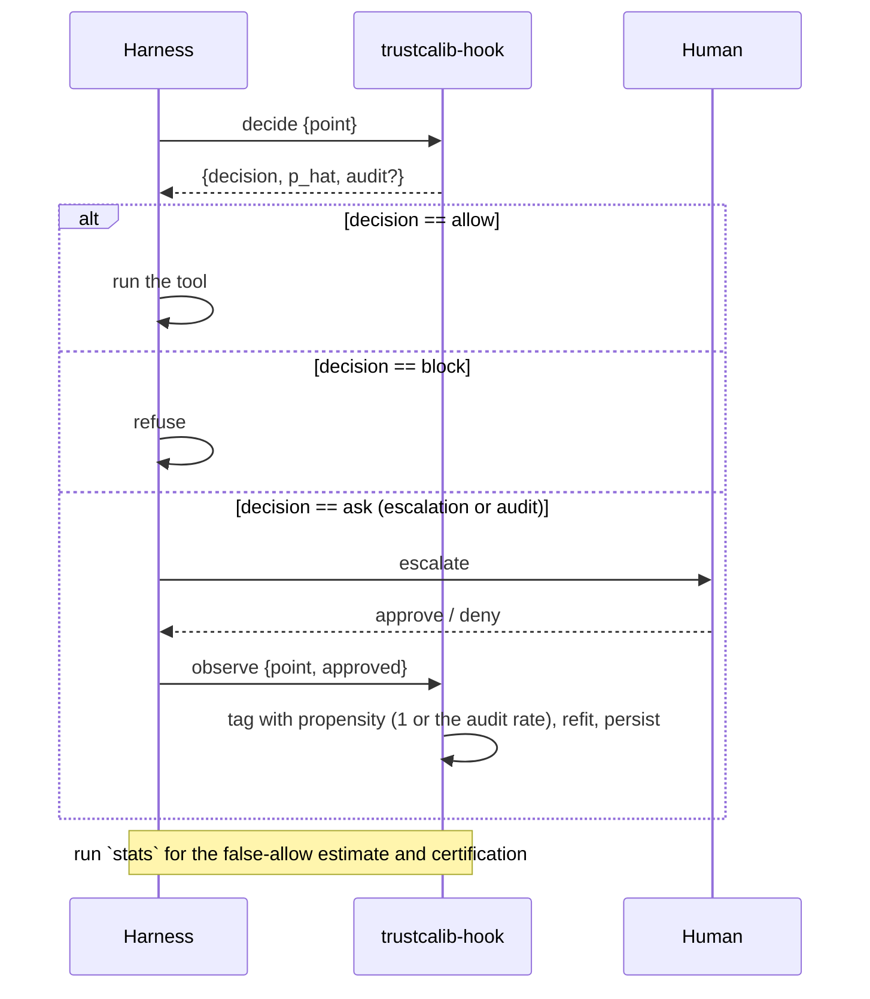
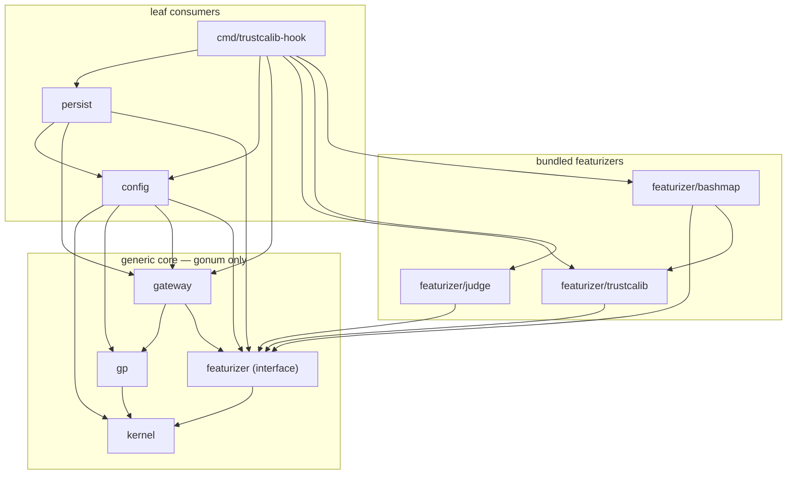

# trustcalib (Go)

A Go implementation of the escalation gateway from the paper *Progressive
Autonomy as Preference Learning*: an online, three-tier **allow / ask / block**
decision layer for agentic tool use. It keeps a Gaussian-process posterior over
the supervisor's latent tolerance, updates it from approve/deny feedback
through a probit likelihood, and turns the posterior into a decision with
cost-derived thresholds (Chow's reject option). It is packaged as a library
plus a thin CLI hook, so a real agent harness (for example through a
`PreToolUse` hook) can gate live tool calls and learn where to escalate from
the supervisor's own decisions, instead of relying on a hand-written rule.

The Go gateway provides:

- **Kernels.** The product kernel (default) and the additive kernel
  (recommended). The additive kernel does not forget static action risk.
- **Thresholds.** Cost-derived instead of tuned on labels.
- **Audits.** Random audits with logged propensities, which give an unbiased
  false-allow estimate and a certification test.
- **Judge featurizer.** For shell-centric harnesses that put an LLM judge in
  front of a general-purpose shell.

Each design choice is explained in the paper section named below (see
[Design](#design)).

> The Python oracle, synthetic stream generator and evaluation code in
> [`../experiment`](../experiment) are simulation scaffolding and are **not**
> ported. In a deployment the approve/deny labels come from the human.

## Contents

- [Install](#install)
- [Quick start: the CLI hook](#quick-start-the-cli-hook)
- [Library usage](#library-usage)
- [Featurizers: mapping tool calls to a Point](#featurizers-mapping-tool-calls-to-a-point)
- [Configuration](#configuration)
- [State files](#state-files)
- [Design](#design)
- [Testing](#testing)
- [References](#references)

## Install

Requires Go 1.26 or later (`go.mod`). The module lives in the `go/`
subdirectory of the repository, so build from source:

```console
$ git clone https://github.com/changkun/trustcalib
$ cd trustcalib/go
$ go build -o trustcalib-hook ./cmd/trustcalib-hook
$ go test ./...
```

Dependencies: [gonum](https://gonum.org) for linear algebra,
`gopkg.in/yaml.v3` for configuration and `golang.org/x/sys` for the state-file
lock.

## Quick start: the CLI hook

`cmd/trustcalib-hook` is a stateless binary meant to be called from an
agent-harness hook before each tool call. Each invocation loads the JSON state
file, acts, and (for writes) saves it back atomically under a file lock. The
harness, or a small adapter script, maps its hook payload to a *point* (below)
and maps the decision back to run, refuse or ask.

```
trustcalib-hook <decide|observe|tune|stats> [--config <path>] [--state <path>]

  --config  YAML hyperparameters (default $XDG_CONFIG_HOME/trustcalib/config.yaml)
  --state   JSON state file      (default $XDG_STATE_HOME/trustcalib/state.json)
```

The featurizer (`featurizer: taxonomy|judge`) and kernel (`kernel.type`) come
from the config. When the config file exists it takes precedence over the
config recorded in the state, so edits apply to an existing state (the model is
refit from the raw labelled points on every load). Without a config file the
state's recorded config is used.

### Subcommands

| Subcommand | stdin | stdout |
|------------|-------|--------|
| `decide`   | a point | `{decision, p_hat}`, plus `audit: true, audited_decision` when an auto-decision is sampled for audit |
| `observe`  | a point plus `approved` | `{ok, num_labels, fitted, tau_low, tau_high}`, plus `audit: true` when the label answers an audit |
| `tune`     | *(none)* | `{tau_low, tau_high, num_labels}` |
| `stats`    | *(none)* | `{fitted, tuned, num_labels, counter, tau_low, tau_high, kernel, featurizer, audit_rate, n_allow, n_block, audits, audit_denied, false_allow_estimate, audits_block, audit_block_approved, false_block_estimate, pending_audits, clean_streak, certify_alpha, certify_delta, certify_n, certified}` |

A point is `{tool, target, task, arg_risk, t?}` for the taxonomy featurizer and
`{judge_verdict?, judge_score?, category?, command?, t?}` for the judge
featurizer.
- If `category` is absent, it is derived from `command` with
  `bashmap.CategoryFromBash`.
- `t` is optional. If it is omitted, the CLI uses a monotonic counter
  persisted in the state and advanced by each `observe`.
- A point the featurizer cannot map (an unknown tool, target or task, or no
  judge verdict or score) fails safe to `{"decision": "ask", "p_hat": 0.5}`
  and exits 0, so the hook never crashes the agent.

In `stats`:
- `false_allow_estimate` is the Horvitz–Thompson estimate (`null` until it is
  defined).
- `audits` and `audit_denied` count audits of auto-ALLOWs.
- `clean_streak` is the current run of clean audits.
- `certify_n` is `ceil(ln(1/delta)/alpha)`, and `certified` says whether the
  streak has reached it.

### Example

```console
$ echo '{"tool":"git_force_push","target":"prod_infra","task":"ops_maintenance","arg_risk":1}' \
    | trustcalib-hook decide --state /tmp/state.json
{"decision":"ask","p_hat":0.5}

$ echo '{"tool":"git_force_push","target":"prod_infra","task":"ops_maintenance","arg_risk":1,"approved":false}' \
    | trustcalib-hook observe --state /tmp/state.json
{"fitted":false,"num_labels":1,"ok":true,"tau_high":0.65,"tau_low":0.35}
```

With the judge featurizer (`featurizer: judge` in the config):

```console
$ echo '{"judge_verdict":"allow","command":"rm -rf ./build && make release"}' \
    | trustcalib-hook decide --config judge.yaml --state /tmp/judge.json
{"decision":"ask","p_hat":0.5}
```

### Audits in the hook

1. `decide` draws `u` from `math/rand/v2` (randomly seeded).
2. A sampled auto-decision is printed as
   `{"decision":"ask","audit":true,"audited_decision":"allow",...}`, so the
   harness shows it to the human like any other ASK.
3. The gateway remembers it in the state as a *pending audit*, together with
   the audit rate in force at that moment. The key is the request's identity:
   every request field except `approved`, and except `t` unless `t` was given
   explicitly.
4. The next `observe` of the same request consumes the pending audit and
   records the label with that propensity instead of 1. The harness needs no
   extra bookkeeping.
5. A later `decide` of the same request supersedes a pending audit, and at
   most 64 are kept.

Because it counts auto-decisions and records pending audits, `decide` writes
the state under the exclusive lock. Concurrent calls therefore queue, and a
read-only state directory makes `decide` fail.

### Typical flow in a harness


```mermaid
sequenceDiagram
    participant H as Harness
    participant G as trustcalib-hook
    participant U as Human
    H->>G: decide {point}
    G-->>H: {decision, p_hat, audit?}
    alt decision == allow
        H->>H: run the tool
    else decision == block
        H->>H: refuse
    else decision == ask (escalation or audit)
        H->>U: escalate
        U-->>H: approve / deny
        H->>G: observe {point, approved}
        G->>G: tag with propensity (1 or the audit rate), refit, persist
    end
    Note over H,G: run `stats` for the false-allow estimate and certification
```

Unaudited `allow`/`block` auto-decisions are not observed, because no human
label exists for them. Only escalated and audited points train the model.

## Library usage

```go
package main

import (
	"fmt"
	"math/rand/v2"

	"github.com/changkun/trustcalib/config"
	"github.com/changkun/trustcalib/featurizer"
	"github.com/changkun/trustcalib/featurizer/trustcalib"
	"github.com/changkun/trustcalib/gateway"
)

func main() {
	// Recommended settings: additive kernel, cost-derived band (0.25, 0.9),
	// audits of 5% of auto-decisions.
	cfg := config.Default()
	cfg.Kernel.Type = config.KernelAdditive
	cfg.Gateway.Costs = &config.CostsCfg{FalseAllow: 10, FalseBlock: 4, Ask: 1}
	cfg.Gateway.AuditRate = 0.05
	g := cfg.NewGateway(trustcalib.New())

	risky := featurizer.Point{
		Tool: "git_force_push", Target: "prod_infra",
		Task: "ops_maintenance", ArgRisk: 1, T: 0,
	}

	// Cold start: no model yet -> ASK at 0.5.
	dec, p, audit := g.DecideAudit(risky, rand.Float64())
	fmt.Println(dec, p, audit) // ask 0.5 false

	switch {
	case audit: // an auto-decision sampled for audit: show it to the human anyway
		_ = g.ObserveAudit(risky, askHuman(risky), dec)
	case dec == gateway.Ask: // escalate; the answer trains the model
		_ = g.Observe(risky, askHuman(risky))
	}

	// ... later: how often does the gateway auto-allow what the human denies?
	est, audits, denied := g.FalseAllowEstimate()
	fmt.Println(est, audits, denied, g.CertifiedFalseAllowBelow(0.01, 0.05))
}

func askHuman(featurizer.Point) bool { return false } // the supervisor's verdict
```

Without `config`, build the pieces directly:
`gateway.New(f, gp.NewLaplaceGPC(kernel.DefaultAdditiveKernel()), gcfg)` with a
`gateway.Config` whose `Costs` and `AuditRate` are set. When the answer to an
audit arrives in a later process, use
`ObserveAuditWithPropensity(p, approved, audited, propensity)` with the audit
rate recorded when the audit was sampled. To use a custom action/context
space, implement `featurizer.Featurizer`
(`Featurize(Point) (FeatureVec, error)`, `DimTool()`, `DimCtx()`) and pass it
to `gateway.New` (or `config.Config.NewGateway`).

### Gateway API

`gateway.Gateway` is the online, stateful form of the Python batch loop:

- `Decide(point)` returns `(Decision, p_hat)` **without** recording anything.
  On cold start (no fitted model) or for a point the featurizer cannot map, it
  fails safe to `Ask` at 0.5.
- `DecideAudit(point, u)` is `Decide` for an action that is actually about to
  run. It also counts auto-`Allow` and auto-`Block` decisions (the audit
  denominators). It returns `audit = true` when the decision is `Allow` or
  `Block` and the caller-supplied uniform draw satisfies `u < AuditRate`. Call
  it once per real action.
- `Observe(point, approved)` appends an escalated label (propensity 1). It
  refits the model every `RefitEvery` new labels, and as soon as two labels
  exist.
- `ObserveAudit(point, approved, audited)` records the answer to an audit of
  the `audited` auto-decision, with propensity `AuditRate`. Audit labels train
  the model like escalations but are not added to the tuning history.
- `FalseAllowEstimate()`, `FalseBlockEstimate()` and
  `CertifiedFalseAllowBelow(alpha, delta)` report on the audits (see
  [Random audits](#random-audits)).
- `Tune()` returns the cost-derived band when `Config.Costs` is set.
  Otherwise it runs the grid search over the collected `(p_hat, label)`
  history, and keeps the default band below `MinTuneN` labels.

Sliding-window caps (`MaxTrain`, `MaxHist`) bound the refit cost for a
long-running process; an unbounded full-set refit is `O(n³)`. The audit
counters are cumulative and never truncated, so the numerators and
denominators of the estimates cover the same period.

## Featurizers: mapping tool calls to a Point

The kernel never sees the `Point` strings directly. The featurizer turns them
into a small numeric risk descriptor, and that descriptor is all the GP uses.
So constructing a `Point` means producing features such that *actions of
similar risk sit close together*. Every feature must be **knowable statically,
before the action runs**, which is the whole purpose of gating.

### Tool taxonomy (`featurizer/trustcalib`, default)

| Field | Becomes | How to fill it |
|-------|---------|----------------|
| `Tool` | reversibility, base-sensitivity, blast, category one-hot | the closest taxonomy profile for the action |
| `Target` | a sensitivity scalar in [0,1] | the most sensitive resource the action touches |
| `ArgRisk` | a 0/1 flag | whether a destructive argument pattern is present |
| `Task` | a task one-hot | the agent's session intent (from the harness, not the action) |
| `T` | recency weight via `k_time` | a monotonic decision counter (the CLI manages this) |

Two principles make this well-defined even for coarse or compound actions:

1. **The unit you featurize is the unit the human approves.** One tool call is
   one `Point`, even if it is a shell command running a chain.
2. **Reduce a chain to its worst case.** Take the most dangerous tool profile,
   the most sensitive target touched, and the logical OR of the
   destructive-argument flag across the whole command.

A coarse tool like Bash is the hard case. The same tool can be `ls` or
`rm -rf /`, so tool identity alone is useless and the command *content* must
drive `Target` and `ArgRisk`. The example package
[`featurizer/bashmap`](featurizer/bashmap/bashmap.go) shows the pattern with
static, worst-case heuristics:

```go
import "github.com/changkun/trustcalib/featurizer/bashmap"

// "ls && terraform apply" -> the deploy dominates:
//   {Tool: "deploy", Target: "prod_infra", ArgRisk: 0, Task: "ops_maintenance"}
p := bashmap.PointFromBash("ls && terraform apply -auto-approve", "ops_maintenance", t)
dec, _ := g.Decide(p)
```

The harness supplies `Task` from the current goal; it is not parsed from the
command. `bashmap` is a heuristic illustration, not a hardened parser. A real
harness should:
- analyze the properly parsed command and tune the rules to its environment;
- for a genuinely different action space, implement its own `Featurizer` over
  a richer descriptor instead of the bundled taxonomy.

The bundled featurizer returns an error for an unknown tool, target or task
string, and the gateway turns that error into a fail-safe **ASK**. A
production featurizer should instead map every possible action to a
worst-case bucket, so that it never escalates merely because something is
unrecognized.

### Harnesses with an LLM judge (`featurizer/judge`)

Shell-centric harnesses (for example the auto modes of Claude Code or Codex)
route everything through one shell tool and put an LLM judge, a permission
classifier, in front of it. There is no fixed tool taxonomy, only the judge's
allow/block verdict. A judge's error rate for a given supervisor cannot be
read off its verdicts, and it changes with the supervisor (paper
Propositions 6 and 7). The gateway therefore treats the judge's output as a
**feature**, not a decision (paper section "Calibrating an Opaque LLM Judge";
simulation in `../experiment/judge.py`). The judge featurizer reads these
`Point` fields:

| Field (JSON) | Becomes | How to fill it |
|--------------|---------|----------------|
| `JudgeVerdict` (`judge_verdict`) | 1 for `"block"`, 0 for `"allow"` | the judge's verdict |
| `JudgeScore` (`judge_score`) | the score itself (used instead of the verdict) | the judge's risk score in [0,1], higher = riskier, if it has one |
| `Category` (`category`) | a one-hot over `read, search, vcs, exec, write, db, network, deploy, other` | `bashmap.CategoryFromBash(command)`; empty or unknown -> `other` |
| `T` (`t`) | recency weight via `k_time` | a monotonic decision counter |

so `phi_tool = [judge feature] ++ category one-hot` (10 dimensions) and
`phi_ctx = [0]`. A point with neither a verdict nor a score is an error, and
so a fail-safe ASK.

With the **additive kernel**:
- The static component learns, per category, how *this* supervisor's
  approvals relate to the judge's output.
- The time components track the supervisor's tolerance.
- The posterior `p_hat` is then the reliability of an individual verdict for
  this supervisor.
- The Chow rule escalates where the judge's verdict is unreliable instead of
  trusting it.
- Audits with logged propensities keep the judge's false-allow rate estimable.

```go
import (
	"github.com/changkun/trustcalib/featurizer"
	"github.com/changkun/trustcalib/featurizer/bashmap"
	"github.com/changkun/trustcalib/featurizer/judge"
)

cfg := config.Default()
cfg.Kernel.Type = config.KernelAdditive
cfg.Gateway.Costs = &config.CostsCfg{FalseAllow: 10, FalseBlock: 4, Ask: 1}
cfg.Gateway.AuditRate = 0.05
g := cfg.NewGateway(judge.New())

// The judge (an auto-mode style classifier) allowed this command. Production
// classifiers such as Claude Code's auto mode and Codex auto-review return a
// verdict, not a calibrated score; set JudgeScore only if your judge exposes
// one (it then replaces the verdict as the feature).
cmd := "rm -rf ./build && make release"
p := featurizer.Point{
	JudgeVerdict: "allow",
	Category:     bashmap.CategoryFromBash(cmd), // "write" (rm -r dominates the chain)
	T:            t,
}
dec, pHat, audit := g.DecideAudit(p, rand.Float64())
```

One limit is structural: the gateway cannot separate actions that look
identical in these features, so it cannot repair a judge blind spot that the
features do not expose, say destructive commands that the judge rates as
benign within a category the supervisor otherwise approves. The remedy is
argument-level features, for example `bashmap`'s static patterns, not more
calibration.

## Configuration

Every hyperparameter can be set in YAML. Omitted keys fall back to the
defaults. Invalid kernel, featurizer, cost, audit and certification values are
rejected at load. See [`trustcalib.example.yaml`](trustcalib.example.yaml):

```yaml
featurizer: taxonomy  # taxonomy (bundled tool/target/task) or judge (LLM judge + category)

kernel:
  type: product    # product (default) or additive (recommended)
  sigma2: 1.6      # product: signal variance (prior diagonal)
  l_tool: 1.1      # product: RBF lengthscale for the tool feature block
  l_ctx:  1.2      # product: RBF lengthscale for the context feature block
  lambda: 200.0    # product: time lengthscale (Ornstein-Uhlenbeck decay, in steps)
  additive:        # used when type: additive (own defaults, including lambda 90)
    s_static: 1.6  # static action-risk component k_x (never forgets)
    s_global: 1.0  # shared-tolerance component k_time
    s_inter:  0.6  # local-drift component k_x * k_time
    l_tool:   1.1
    l_ctx:    1.2
    lambda:   90.0
gp:
  jitter:   1.0e-6 # Tikhonov regularization on the kernel diagonal
  max_iter: 100    # Newton iterations for the Laplace mode
  tol:      1.0e-6 # convergence tolerance on the objective
gateway:
  tau_low:     0.35  # below -> BLOCK (ignored when costs are set)
  tau_high:    0.65  # above -> ALLOW (ignored when costs are set)
  refit_every: 8     # refit the model every N new labels
  safety_eps:  0.02  # false-allow cap for tuning (tightened to /2)
  block_eps:   0.05  # false-block cap for tuning
  max_train:   2000  # sliding-window cap on training points (0 = unbounded)
  max_hist:    2000  # sliding-window cap on tuning history (0 = unbounded)
  min_tune_n:  30    # minimum labels before tuning leaves the default band
  costs:             # optional; all three required -> band (ask/false_block, 1 - ask/false_allow)
    false_allow: 10
    false_block: 4
    ask:         1
  audit_rate:    0     # probability of auditing an auto-decision (0 = no audits)
  certify_alpha: 0.01  # stats: certify false-allow rate below alpha ...
  certify_delta: 0.05  # ... with confidence 1 - delta (300 clean audits here)
```

The example file keeps `costs` commented out so that it equals the defaults:
no costs, which gives the fixed band `(0.35, 0.65)`. The recommended
configuration is `kernel.type: additive`, `gateway.costs` set and
`gateway.audit_rate > 0`. The product kernel stays the default so that existing
configurations and state files behave as before.

## State files

`persist` serializes the gateway so that the stateless hook carries the
learned model across invocations. It stores:
- the **raw labelled points** and each label's provenance (source and
  propensity);
- the tuning history;
- the audit counters and pending audits;
- the thresholds and hyperparameters.

It does not store the fitted Cholesky factor; the model is **refit on load**.
This keeps the state small and consistent across hyperparameter or featurizer
changes: a point the current featurizer cannot map simply stops contributing
evidence. `Save` writes atomically (temp file plus rename) under a file lock,
so a crashed or concurrent invocation never corrupts the state.

State files written before audits were added load unchanged:
- every stored label is taken to be an escalation with propensity 1;
- the audit counters start at zero;
- config keys the file predates take their defaults (product kernel, taxonomy
  featurizer, no costs, no audits).

With `costs` configured, persisted thresholds are ignored in favour of the
cost band.

One consequence of refit-on-load: the live model refits only every
`refit_every` labels, whereas a reloaded gateway refits from *all* stored
points. So between refit boundaries, a reloaded gateway can be slightly
fresher than the live one was. This is the more correct behaviour in
production, but live and reloaded predictions are not bit-identical
mid-window.

## Design

Each proposed tool call is a **decision point** `x = (a, c)` arriving at time
`t`: an action `a` (the tool and its risk attributes) in a context `c` (the
target resource, the task, and whether a destructive argument is present). A
**featurizer** maps it to two feature blocks (`phi_tool`, `phi_ctx`) plus the
time `t`. The gateway predicts an **approval probability** `p_hat(x)` and
applies a three-tier rule:


```mermaid
flowchart TD
    x["decision point x = (a, c) at time t"] --> feat["featurize -> phi_tool, phi_ctx"]
    feat --> gp["GP posterior: p_hat(x)"]
    gp --> rule{"compare to thresholds"}
    rule -->|"p_hat &gt; tau_high"| allow(["ALLOW (auto-approve)"])
    rule -->|"p_hat &lt; tau_low"| block(["BLOCK (auto-deny)"])
    rule -->|"otherwise"| ask(["ASK (escalate to human)"])
    allow -.->|"audit with prob. eps"| audit(["AUDIT (show to human anyway)"])
    block -.->|"audit with prob. eps"| audit
    ask --> obs["human approves / denies -> Observe -> refit"]
    audit --> aobs["human approves / denies -> ObserveAudit (propensity eps)"]
    obs -.->|new evidence| gp
    aobs -.->|new evidence| gp
```

**ASK** points are shown to the human, and their approve/deny answers become
training labels. `ALLOW` and `BLOCK` are auto-decided at no human cost, so
their errors are invisible (*selective labels*). With an audit rate `eps > 0`,
each auto-decision is also shown to the human with probability `eps`, which
makes the false-allow rate estimable. The model refits online as labels
accumulate.

### Package layout

```
go/
  kernel/                 Kernel interface, product and additive kernels (stateless)
  gp/                     Laplace GP-probit classifier over any Kernel
  gateway/                three-tier policy, costs, audits, online loop, tuning
  featurizer/             pluggable Featurizer interface (Point -> FeatureVec, Pack)
    trustcalib/           default: the paper's tool/target/task taxonomy
    judge/                LLM-judge verdict/score + coarse command category
    bashmap/              example: shell command -> Point / category heuristics
  config/                 YAML hyperparameter loader -> kernel/model/gateway
  persist/                atomic JSON state, refit-on-load (for the CLI hook)
  cmd/trustcalib-hook/    CLI: decide / observe / tune / stats
  internal/testutil/      golden-fixture loaders (tests only)
  testdata/
    fixtures/*.json       golden outputs exported from the Python reference
    gen/export_fixtures.py  regenerates the fixtures
```

**Dependency direction.**
- `kernel`, `gp` and `gateway` depend only on gonum and on the `featurizer`
  *types*, never on a concrete featurizer.
- The taxonomy lives only in `featurizer/trustcalib`; the judge featurizer
  needs no taxonomy at all. A harness that wants its own action/context space
  implements `featurizer.Featurizer` and imports neither.
- `config`, `persist` and `cmd` are leaf consumers, and only `cmd` chooses a
  concrete featurizer.

Arrows point from a package to the packages it imports:


```mermaid
graph TD
    subgraph core["generic core — gonum only"]
        kernel
        gp
        gateway
        featurizer["featurizer (interface)"]
    end
    subgraph featurizers["bundled featurizers"]
        tc["featurizer/trustcalib"]
        judge["featurizer/judge"]
        bashmap["featurizer/bashmap"]
    end
    subgraph consumers["leaf consumers"]
        config
        persist
        cmd["cmd/trustcalib-hook"]
    end

    gp --> kernel
    featurizer --> kernel
    gateway --> gp
    gateway --> featurizer
    tc --> featurizer
    judge --> featurizer
    bashmap --> featurizer
    bashmap --> tc
    config --> kernel
    config --> gp
    config --> gateway
    config --> featurizer
    persist --> config
    persist --> gateway
    persist --> featurizer
    cmd --> persist
    cmd --> config
    cmd --> gateway
    cmd --> tc
    cmd --> judge
    cmd --> bashmap
```

### Kernels (`kernel`)

Similarity between two decision points is built from three block kernels over
action, context and time (paper section "Trust Calibration as Classification
with a Reject Option"):

- `k_tool` and `k_ctx` are squared-exponential (RBF) kernels
  `exp(-d² / (2 l²))` over the tool and context feature blocks, with
  lengthscales `l_tool` and `l_ctx`. Their product `k_x = k_tool * k_ctx` is
  the static similarity of two actions.
- `k_time(t, t') = exp(-|t - t'| / lambda)` is the Ornstein–Uhlenbeck
  covariance, which down-weights stale evidence.

Both kernels implement `kernel.Kernel` (`Full`, `Cross`, `Diag`) and work on
raw feature vectors via `Packed` (dense `phi_tool` and `phi_ctx` matrices and
a time slice). `gp.NewLaplaceGPC` accepts either.

**Product kernel (`kernel.ProductKernel`, default):**

```
k(x, x') = sigma2 * k_tool(a, a') * k_ctx(c, c') * k_time(t, t')
```

Every component is multiplied by `k_time`, so *all* evidence, including the
static risk structure of an action, is forgotten at rate `1/lambda` (paper
Proposition 4). Once the labels near an action are older than a few `lambda`,
its posterior returns to the prior, `p_hat = 1/2`, and it is escalated again.
The gateway keeps asking about actions whose risk has not changed, and cannot
carry what it learned about an action's risk forward in time. Defaults
(`kernel.DefaultKernel()`): `sigma2 = 1.6`, `l_tool = 1.1`, `l_ctx = 1.2`,
`lambda = 200`. The paper's experiments use `lambda = 90`.

**Additive kernel (`kernel.AdditiveKernel`, recommended):**

```
k(x, x') = s_static * k_x(x, x')                  static action risk r(x)
         + s_global * k_time(t, t')               shared tolerance tau(t)
         + s_inter  * k_x(x, x') * k_time(t, t')  local drift
```

This mirrors the latent-tolerance decomposition `f(x, t) = tau(t) - r(x)` of
the paper, and only the time-coupled components forget:
- The **static** component never decays, so what has been learned about how
  risky an action is persists.
- The **global** component is shared by every action, so every label,
  whatever its action, updates the supervisor's current tolerance `tau(t)`.
- The **interaction** component lets individual actions drift locally.

Defaults (`kernel.DefaultAdditiveKernel()`): `s_static = 1.6`,
`s_global = 1.0`, `s_inter = 0.6`, `l_tool = 1.1`, `l_ctx = 1.2`,
`lambda = 90`.

Every block is positive semidefinite with unit self-similarity, and sums and
(Schur) products of PSD kernels are PSD, so both kernels are valid
covariances. The prior variance on the diagonal is `sigma2` for the product
kernel and `s_static + s_global + s_inter` for the additive one.

### Laplace GP-probit classifier (`gp`)

A direct port of `../experiment/gp.py` (Rasmussen & Williams 2006, Algorithms
3.1 and 3.2) for the probit likelihood, with labels in `{-1, +1}` and any
`kernel.Kernel`:

```
log p(y|f) = log Phi(y f)
d/df log p = y * phi(z)/Phi(z)              (Mills ratio, z = y f)
W          = (phi/Phi)^2 + z*(phi/Phi)      (Hessian diagonal, >= 0)
```

- **Fit** (`Fit`) finds the posterior mode by Newton iteration. Each step
  builds `B = I + W^{1/2} K W^{1/2}` (SPD by construction), Cholesky-factorizes
  it, and solves for the update. It stops when the objective stops changing.
- **Predict** (`Predict`/`PredictProb`) returns the latent mean and variance
  and the approval probability `pi = Phi(f_bar / sqrt(1 + var))` (the
  probit-Gaussian convolution).

Two numerical details matter and are tested explicitly:

- The Mills ratio is evaluated as `exp(logPDF(z) - logCDF(z))`. The
  **stable `logCDF`** (`gp/probit.go`) uses `log1p`/`erfc` near zero and an
  asymptotic tail series below `z = -37`, so it stays finite where
  `log(CDF(z))` would underflow to `-Inf`. It matches scipy's `log_ndtr` down
  to `z = -40`.
- The predictive variance reduction is computed as `Mᵀ B⁻¹ M` via the stored
  Cholesky factor. This is algebraically equal to R&W's `‖L⁻¹ M‖²`
  forward-solve.

Linear algebra (Cholesky, solves, matrix-vector products) uses
`gonum.org/v1/gonum/mat`; the normal CDF uses `math.Erfc`.

### Thresholds (`gateway.Costs` and `gateway.TuneThresholds`)

**Cost-derived thresholds (recommended).** Three costs define the rule:
- `c_FA`: auto-allowing an action the human would deny;
- `c_FB`: auto-blocking an action the human would approve;
- `c_ask`: one escalation.

With these costs the three-tier rule is the Bayes-optimal one-step decision
(Chow's reject option; paper section "The decision rule", Proposition 2),
with

```
tau_low  = c_ask / c_FB
tau_high = 1 - c_ask / c_FA
```

For example:
- `gateway.Costs{FalseAllow: 10, FalseBlock: 4, Ask: 1}` gives the band
  `(0.25, 0.9)`.
- The symmetric band `(0.35, 0.65)` is exactly the case
  `c_FA = c_FB = c_ask / 0.35` (`gateway.SymmetricCosts(0.35)`).

The ASK band is non-empty iff `c_ask (c_FA + c_FB) < c_FA c_FB`
(`Costs.BandNonEmpty`). For an empty band the closed forms cross, and
`Costs.Band` collapses both thresholds to the allow/block indifference point
`c_FA / (c_FA + c_FB)`, so the rule stays loss-minimal and never asks.

Set `Config.Costs` (or `gateway.costs` in YAML). The thresholds are then
*specified*: they need no labels, and `Tune()` returns them unchanged.
Persisted thresholds are ignored in favour of the costs.

**Grid-search tuning (`TuneThresholds`).** The search runs over
`linspace(0.05, 0.95, 19)` (a port of `experiment/gateway.py:tune_thresholds`).
It considers threshold pairs `lo < hi` whose auto-decisions meet three
constraints:
- a **safety cap**: false-allow rate `<= safety_eps/2`;
- a **usefulness cap**: false-block rate `<= block_eps`;
- a minimum auto-coverage: ask rate `<= 0.6`.

Among these it picks the pair with the smallest ask rate. If none is feasible,
or the best still escalates more than 70% of traffic, it falls back to the
default `(0.35, 0.65)`. It is kept for backward compatibility only, and in
practice it cannot move:
- Tuning needs labels for auto-decided actions, which a deployment does not
  have.
- The history the gateway collects is recorded at ASK time, so every `p_hat`
  in it lies inside the current band, where the labels are close to coin
  flips.
- Any pair that auto-decides enough of that history violates a cap, so no pair
  is feasible and `Tune()` returns the default band.

### Random audits

Only escalated actions are labelled, so the false-allow rate of auto-decided
actions cannot be estimated from escalations (paper section "Selective labels
and audits"). With `AuditRate = eps > 0`, each auto-decided action is also
shown to the human with probability `eps`. Each label's **propensity** is
logged: 1 for an ASK, and `eps` for an audit, with audits of `ALLOW` kept
apart from audits of `BLOCK`.

- **Horvitz–Thompson estimate** (Proposition 5(a)). With `N_allow`
  auto-ALLOWs counted by `DecideAudit`,

  ```
  FA_hat = (sum over audited auto-ALLOWs the human denied of 1/propensity) / N_allow
         = (denied / eps) / N_allow          (constant audit rate)
  ```

  is unbiased for the realized false-allow rate. `FalseAllowEstimate()`
  returns it together with the number of audits and denials. The estimate is
  NaN when it is undefined: no auto-ALLOW yet, or auditing disabled. With a
  few dozen audits it is noisy: audits make the error rate estimable, not
  small.
- **Certification** (Proposition 5(b)). If the true false-allow rate were at
  least `alpha`, `n` independent audits would all come back clean with
  probability at most `(1 - alpha)^n <= exp(-alpha n)`. That is at most
  `delta` once `n >= ln(1/delta) / alpha`.
  - `CertifiedFalseAllowBelow(alpha, delta)` is true iff the number of
    consecutive most recent clean audits of auto-ALLOWs meets that bound.
  - `gateway.CertificationSize` gives the bound: 300 for `alpha = 1%`,
    `delta = 5%`, and 12 for `alpha = 25%`.
  - A single denied audit restarts the count, so the claim is "false-allow
    rate below `alpha` for this supervisor over the last `n` audits".

## Testing

```console
$ go test ./...                 # all tests (uses committed golden fixtures)
$ go test -race ./...           # what CI runs
```

Correctness is established in two ways.

**Golden fixtures** are exported from the Python reference and checked
numerically for both kernels:
- the kernel matrix to `1e-9`;
- the Laplace fit and predictions to `1e-7`;
- the stable `logCDF`/`logPDF` to `1e-10`, including the deep `z = -40` tail.

**Ported property tests** cover:
- **Kernels.** Symmetry, PSD and the prior diagonal for both kernels. The
  additive kernel keeps `s_static` for the same action far apart in time,
  where the product kernel decays to 0. A GP test checks that the product
  kernel returns an old label to `p_hat = 1/2` while the additive one does
  not.
- **Laplace approximation.** Mode stationarity (`‖f_hat - K·grad‖ < 1e-5`), a
  finite-difference gradient check, and 1-D recovery (monotone boundary,
  accuracy).
- **Decision rule.** The Chow rule's closed form and its expected-loss
  optimality on a grid of `p` (`test_chow.py`), and the degeneracy of the
  grid-search tuner on ASK-time history.
- **Audits.** The Horvitz–Thompson estimate, audit propensities and the
  `ln(1/delta)/alpha` certification size (`test_audit.py`).
- **Human burden.** A replay of a recorded trajectory with each kernel,
  asserting a substantial auto-decision rate, high accuracy, a bounded
  false-allow rate and far fewer queries than escalating every action.

### Regenerating fixtures

The fixtures are committed, so the tests run without Python. To regenerate
them (for example after changing the kernel or the GP), run from the
repository root:

```console
PYTHONPATH=. uv run python go/testdata/gen/export_fixtures.py
```

The generator imports only `experiment.kernel` and `experiment.gp` (plus the
oracle, for the burden trajectory) and writes the resulting arrays verbatim to
JSON, so the Go tests never need to reproduce NumPy's RNG. The additive-kernel
fixtures (`kernel_additive.json`, `laplace_fit_additive.json`,
`predict_additive.json`) reuse the product fixtures' points and labels. A
different NumPy/BLAS build may change the last digit of existing fixtures
(differences at the `1e-16` level), far inside the test tolerances.

## References

- Rasmussen & Williams, *Gaussian Processes for Machine Learning* (2006),
  Algorithms 3.1 (Laplace mode) and 3.2 (prediction).
- Chow, "On optimum recognition error and reject tradeoff", *IEEE Trans.
  Information Theory* (1970). The reject-option rule behind the cost-derived
  thresholds.
- Horvitz & Thompson, "A generalization of sampling without replacement from a
  finite universe", *JASA* (1952). The audit estimator.
- The paper and the Python reference implementation:
  [`../manuscript`](../manuscript) and [`../experiment`](../experiment).
