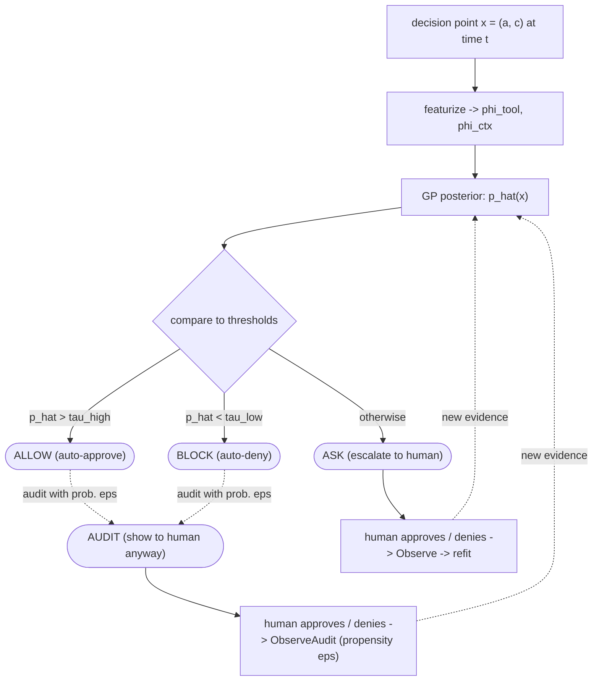
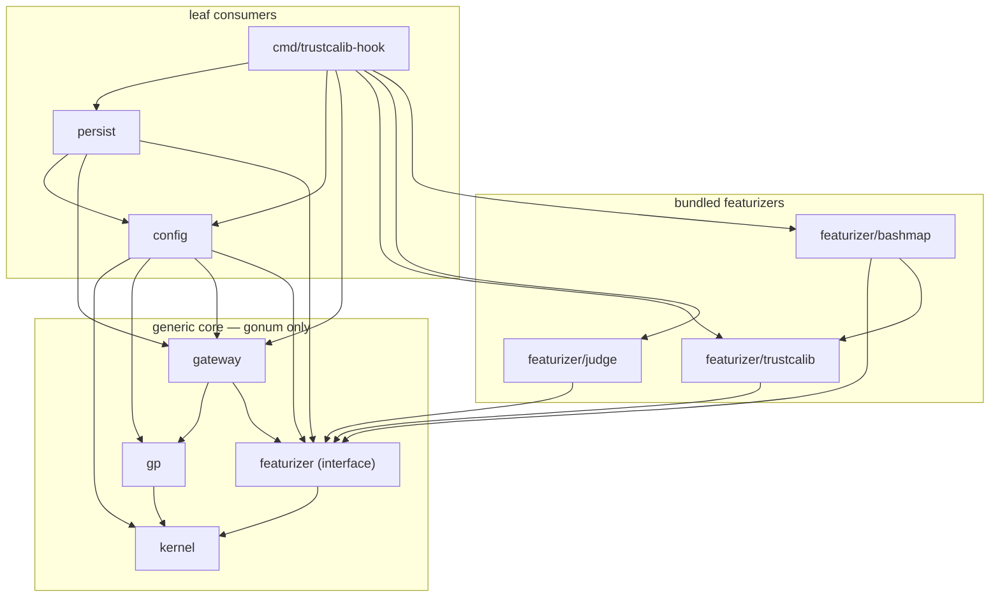
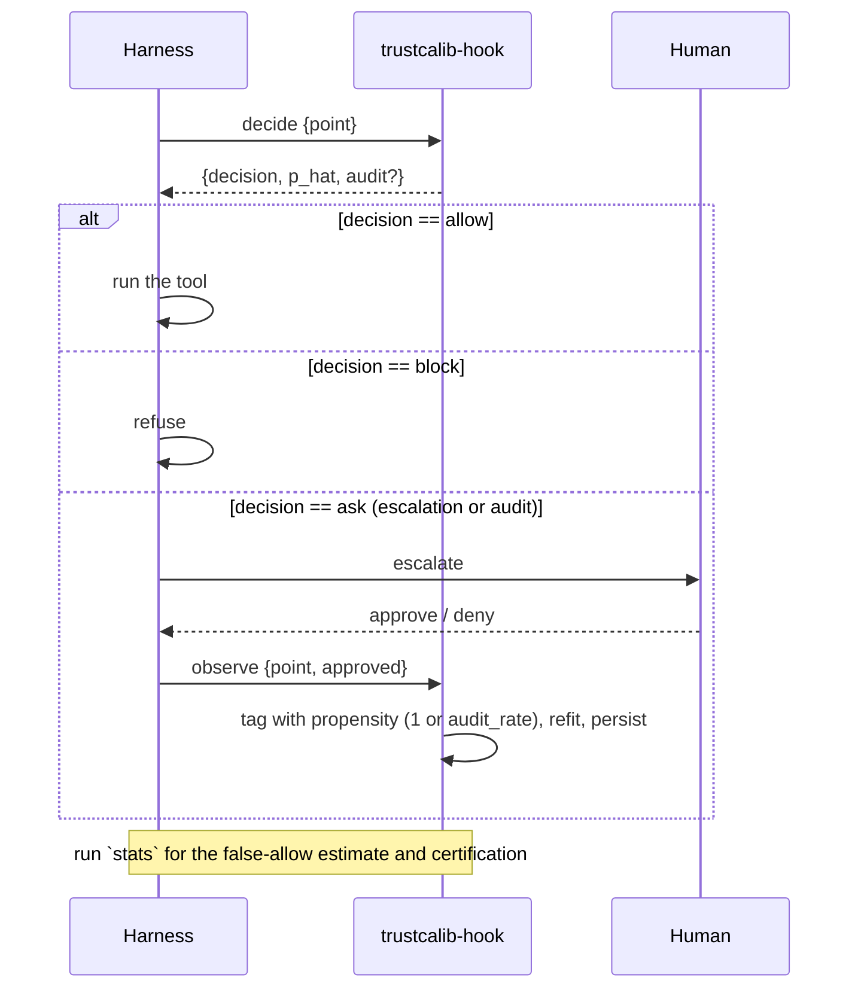

# trustcalib (Go)

A Go implementation of the trustcalib **policy gateway**: an online, three-tier
**allow / ask / block** decision layer for agentic tool use. It maintains a
Gaussian-process posterior over a latent human *risk-tolerance* function,
observes that function through probit approve/deny feedback, and escalates to a
human exactly where the approval outcome is most uncertain.

This module is the reusable core of the
[trustcalib manuscript](../manuscript) ported out of the Python simulation
(`../experiment`) and packaged as a library plus a thin CLI hook, so a real
agent harness (for example a Claude Code `PreToolUse` hook) can gate live tool
calls and learn where to escalate from the supervisor's own approvals instead
of a hand-written rule.

It follows versions 2 and 3 of the manuscript: an **additive kernel** that
does not forget static action risk, **cost-derived thresholds** instead of
tuning on labels, **random audits** with logged propensities for an unbiased
false-allow estimate and a certification test, and (the version-3 opaque-judge
extension) a **judge featurizer** for shell-centric harnesses that put an LLM
judge in front of a general-purpose shell. The
version-1 behaviour (product kernel, fixed band, `tune`) remains the default,
so existing configurations and state files keep working.

> The Python oracle, synthetic stream generator and evaluation/figure code are
> **not** ported — they are simulation scaffolding. In a real deployment the
> approve/deny labels come from the human, not an oracle.

## Contents

- [Concepts](#concepts)
- [Architecture](#architecture)
- [The algorithm](#the-algorithm)
- [Library usage](#library-usage)
- [Mapping real tool calls to a Point](#mapping-real-tool-calls-to-a-point)
- [CLI hook](#cli-hook)
- [Configuration](#configuration)
- [Persistence](#persistence)
- [Testing and validation](#testing-and-validation)

## Concepts

Each proposed tool call is a **decision point** `x = (a, c)` arriving at time
`t`: an action `a` (the tool and its risk attributes) in a context `c` (the
target resource, task, and whether a destructive argument is present). A
**featurizer** maps it to two feature blocks (`phi_tool`, `phi_ctx`) plus the
time `t`.

The gateway predicts an **approval probability** `p_hat(x)` and applies a
three-tier rule:


```mermaid
flowchart TD
    x["decision point x = (a, c) at time t"] --> feat["featurize -> phi_tool, phi_ctx"]
    feat --> gp["GP posterior: p_hat(x)"]
    gp --> rule{"compare to thresholds"}
    rule -->|"p_hat &gt; tau_high"| allow(["ALLOW (auto-approve)"])
    rule -->|"p_hat &lt; tau_low"| block(["BLOCK (auto-deny)"])
    rule -->|"otherwise"| ask(["ASK (escalate to human)"])
    allow -.->|"audit with prob. eps"| audit(["AUDIT (show to human anyway)"])
    block -.->|"audit with prob. eps"| audit
    ask --> obs["human approves / denies -> Observe -> refit"]
    audit --> aobs["human approves / denies -> ObserveAudit (propensity eps)"]
    obs -.->|new evidence| gp
    aobs -.->|new evidence| gp
```

**ASK** points are shown to the human and their approve/deny answers become
training labels. `ALLOW`/`BLOCK` are auto-decided at zero human cost, so their
errors are invisible (*selective labels*); with an audit rate `eps > 0`, each
auto-decision is also shown to the human with probability `eps`, which makes
the false-allow rate estimable. The model refits online as labels accumulate.
The thresholds `(tau_low, tau_high)` are best **derived from costs** (a false
allow, a false block, one escalation); the version-1 alternative, tuning them
on the collected history, degenerates to the default band (see
[Thresholds](#thresholds-gatewaycosts-and-gatewaytunethresholds)).

## Architecture

```
go/
  kernel/                 generic core: Kernel interface, product and additive kernels (stateless)
  gp/                     generic core: Laplace GP-probit classifier over any Kernel
  gateway/                generic core: three-tier policy, costs, audits, online loop, tuning
  featurizer/             pluggable Featurizer interface (Point -> FeatureVec, Pack)
    trustcalib/           bundled default: manuscript tool/target/task taxonomy
    judge/                LLM-judge verdict/score + coarse command category
    bashmap/              example: shell command -> Point / category heuristics
  config/                 YAML hyperparameter loader -> kernel/model/gateway
  persist/                atomic JSON state, refit-on-load (for the CLI hook)
  cmd/trustcalib-hook/    CLI: decide / observe / tune / stats
  internal/testutil/      golden-fixture loaders (tests only)
  testdata/
    fixtures/*.json       golden outputs exported from the Python reference
    gen/export_fixtures.py  regenerates the fixtures
```

**Dependency direction.** `kernel`, `gp` and `gateway` depend only on
[gonum](https://gonum.org) and the `featurizer` *types* — never on a concrete
featurizer. The taxonomy lives only in `featurizer/trustcalib`; the judge
featurizer needs no taxonomy at all. A harness that wants its own
action/context space implements `featurizer.Featurizer` and never imports
either. `config`, `persist` and `cmd` are leaf consumers; only `cmd` chooses a
concrete featurizer.

Arrows point from a package to the packages it imports:


```mermaid
graph TD
    subgraph core["generic core — gonum only"]
        kernel
        gp
        gateway
        featurizer["featurizer (interface)"]
    end
    subgraph featurizers["bundled featurizers"]
        tc["featurizer/trustcalib"]
        judge["featurizer/judge"]
        bashmap["featurizer/bashmap"]
    end
    subgraph consumers["leaf consumers"]
        config
        persist
        cmd["cmd/trustcalib-hook"]
    end

    gp --> kernel
    featurizer --> kernel
    gateway --> gp
    gateway --> featurizer
    tc --> featurizer
    judge --> featurizer
    bashmap --> featurizer
    bashmap --> tc
    config --> kernel
    config --> gp
    config --> gateway
    config --> featurizer
    persist --> config
    persist --> gateway
    persist --> featurizer
    cmd --> persist
    cmd --> config
    cmd --> gateway
    cmd --> tc
    cmd --> judge
    cmd --> bashmap
```

## The algorithm

### Structured kernels (`kernel`)

Similarity between two decision points is built from three block kernels over
action, context and time (manuscript Section 4):

- `k_tool`, `k_ctx` are squared-exponential (RBF) kernels
  `exp(-d² / (2 l²))` over the tool and context feature blocks, with
  lengthscales `l_tool`, `l_ctx`; their product `k_x = k_tool * k_ctx` is the
  static similarity of two actions.
- `k_time(t, t') = exp(-|t - t'| / lambda)` is the Ornstein-Uhlenbeck covariance
  that down-weights stale evidence (Section 6 non-stationarity).

Both kernels implement `kernel.Kernel` (`Full`, `Cross`, `Diag`) and work on
raw feature vectors via `Packed` (dense `phi_tool`, `phi_ctx` matrices and a
time slice); `gp.NewLaplaceGPC` accepts either.

**Product kernel (v1, `kernel.ProductKernel`, the default):**

```
k(x, x') = sigma2 * k_tool(a, a') * k_ctx(c, c') * k_time(t, t')
```

Every component is multiplied by `k_time`, so *all* evidence, including the
static risk structure of an action, is forgotten at rate `1/lambda`
(manuscript Proposition 4). Once the labels near an action are older than a few
`lambda`, its posterior returns to the prior, `p_hat = 1/2`, and it is
re-escalated: the gateway keeps asking about actions whose risk has not
changed, and cannot generalize what it learned about one action's risk across
time.

**Additive kernel (v2, `kernel.AdditiveKernel`, recommended):**

```
k(x, x') = s_static * k_x(x, x')                  static action risk r(x)
         + s_global * k_time(t, t')               shared tolerance tau(t)
         + s_inter  * k_x(x, x') * k_time(t, t')  local drift
```

This mirrors the decomposition `f(x, t) = tau(t) - r(x)` of the manuscript
(Section 3). Only the time-coupled components forget: the **static** component
never decays, so what has been learned about how risky an action is persists;
the **global** component is shared by every action, so every label, whatever
its action, updates the supervisor's current tolerance `tau(t)`; the
**interaction** component lets individual actions drift locally. Defaults
(`kernel.DefaultAdditiveKernel()`): `s_static = 1.6`, `s_global = 1.0`,
`s_inter = 0.6`, `l_tool = 1.1`, `l_ctx = 1.2`, `lambda = 90`.

Every block is PSD with unit self-similarity, and sums and (Schur) products of
PSD kernels are PSD, so both are valid covariances; the prior variance on the
diagonal is `sigma2` for the product kernel and `s_static + s_global + s_inter`
for the additive one.

### Laplace GP-probit classifier (`gp`)

A direct port of `experiment/gp.py` (Rasmussen & Williams 2006, Algorithms
3.1/3.2) for the probit likelihood with labels in `{-1, +1}`, over any
`kernel.Kernel`:

```
log p(y|f) = log Phi(y f)
d/df log p = y * phi(z)/Phi(z)              (Mills ratio, z = y f)
W          = (phi/Phi)^2 + z*(phi/Phi)      (Hessian diagonal, >= 0)
```

- **Fit** (`Fit`) finds the posterior mode by a Newton iteration. Each step
  builds `B = I + W^{1/2} K W^{1/2}` (SPD by construction), Cholesky-factorizes
  it, and solves for the update; it stops when the objective stops changing.
- **Predict** (`Predict`/`PredictProb`) returns the latent mean/variance and the
  approval probability `pi = Phi(f_bar / sqrt(1 + var))` (probit-Gaussian
  convolution).

Two numerical details matter and are tested explicitly:

- The Mills ratio is evaluated as `exp(logPDF(z) - logCDF(z))`, with a
  **stable `logCDF`** (`gp/probit.go`) that uses `log1p`/`erfc` near zero and an
  asymptotic tail series below `z = -37`, so it stays finite where
  `log(CDF(z))` would underflow to `-Inf` (matches scipy's `log_ndtr` down to
  `z = -40`).
- The predictive variance reduction is computed as `Mᵀ B⁻¹ M` (via the stored
  Cholesky factor), algebraically equal to R&W's `‖L⁻¹ M‖²` forward-solve.

Linear algebra (Cholesky, solves, matrix-vector products) uses
`gonum.org/v1/gonum/mat`; the normal CDF uses `math.Erfc`.

### Gateway: online policy + acquisition (`gateway`)

`gateway.Gateway` is the online, stateful redesign of the Python batch loop:

- `Decide(point)` returns `(Decision, p_hat)` **without** recording anything;
  on cold start (unfitted) or an unknown point it fails safe to `Ask` at 0.5.
- `DecideAudit(point, u)` is `Decide` for an action that is actually about to
  run: it also counts auto-`Allow`/`Block` decisions (the audit denominators)
  and returns `audit = true` when the decision is `Allow` or `Block` and the
  caller-supplied uniform draw `u < AuditRate`. Call it once per real action.
- `Observe(point, approved)` appends an escalated label (propensity 1) and
  refits the model every `RefitEvery` new labels (and as soon as two labels
  exist).
- `ObserveAudit(point, approved, audited)` records the answer to an audit of
  the `audited` auto-decision with propensity `AuditRate`. Audit labels train
  the model like escalations but are not added to the tuning history.
- `FalseAllowEstimate()`, `FalseBlockEstimate()` and
  `CertifiedFalseAllowBelow(alpha, delta)` report on the audits (see
  [below](#random-audits-gatewaydecideaudit)).
- `Tune()` returns the cost-derived band when `Config.Costs` is set, and
  otherwise runs the legacy grid search over the collected `(p_hat, label)`
  history; below `MinTuneN` labels it keeps the default band.

Sliding-window caps (`MaxTrain`, `MaxHist`) bound the refit cost for a
long-running process — the manuscript's unbounded full-set refit is `O(n³)`.
The audit counters are cumulative and never truncated, so the estimates'
numerators and denominators cover the same period.

### Thresholds (`gateway.Costs` and `gateway.TuneThresholds`)

**Cost-derived thresholds (recommended).** With costs `c_FA` (auto-allowing an
action the human would deny), `c_FB` (auto-blocking one they would approve) and
`c_ask` (one escalation), the three-tier rule is the Bayes-optimal one-step
decision (Chow's reject option, manuscript Proposition 2, machine-checked in
`lean/TrustCalib/Chow.lean`) with

```
tau_low  = c_ask / c_FB
tau_high = 1 - c_ask / c_FA
```

For example `gateway.Costs{FalseAllow: 10, FalseBlock: 4, Ask: 1}` gives the
band `(0.25, 0.9)`, and the v1 band `(0.35, 0.65)` is exactly the symmetric
case `c_FA = c_FB = c_ask / 0.35` (`gateway.SymmetricCosts(0.35)`). The ASK band
is non-empty iff `c_ask (c_FA + c_FB) < c_FA c_FB` (`Costs.BandNonEmpty`); for an
empty band the closed forms cross, and `Costs.Band` collapses both thresholds to
the allow/block indifference point `c_FA / (c_FA + c_FB)` so the rule stays
loss-minimal and never asks. Set `Config.Costs` (or `gateway.costs` in YAML):
the thresholds are then *specified*, need no labels, and `Tune()` returns them
unchanged. Persisted thresholds are ignored in favour of the costs.

**Legacy grid search (`TuneThresholds`).** A grid search over
`linspace(0.05, 0.95, 19)` (port of `experiment/gateway.py:tune_thresholds`).
Among threshold pairs `lo < hi` whose auto-decisions respect a **safety cap**
(false-allow rate `<= safety_eps/2`), a **usefulness cap** (false-block rate
`<= block_eps`) and a minimum auto-coverage (ask rate `<= 0.6`), it picks the
one with the smallest ask rate; if none is feasible (or the best still
escalates more than 70% of traffic) it falls back to the default `(0.35, 0.65)`.
It is kept for backward compatibility only. Tuning needs labels for
auto-decided actions, which a deployment does not have: the history the
gateway collects is recorded at ASK time, so every `p_hat` in it lies inside
the current band, where the labels are close to coin flips. Any pair that
auto-decides enough of that history violates a cap, no pair is feasible, and
`Tune()` returns the default band — it cannot move.

### Random audits (`gateway.DecideAudit`)

Only escalated actions are labelled, so the false-allow rate of auto-decided
actions cannot be estimated from escalations (manuscript Section 8). With
`AuditRate = eps > 0`, each auto-decided action is also shown to the human with
probability `eps`, and each label's **propensity** is logged: 1 for an ASK,
`eps` for an audit (distinguishing audits of `ALLOW` from audits of `BLOCK`).

- **Horvitz–Thompson estimate** (Proposition 5(a)). With `N_allow`
  auto-ALLOWs counted by `DecideAudit`,

  ```
  FA_hat = (sum over audited auto-ALLOWs the human denied of 1/propensity) / N_allow
         = (denied / eps) / N_allow          (constant audit rate)
  ```

  is unbiased for the realized false-allow rate. `FalseAllowEstimate()` returns
  it with the number of audits and denials (NaN when undefined: no auto-ALLOW
  yet, or auditing disabled). With a few dozen audits it is noisy: audits make
  the error rate estimable, not small.
- **Certification** (Proposition 5(b), `lean/TrustCalib/Audit.lean`). If the
  true false-allow rate were at least `alpha`, `n` independent audits would all
  come back clean with probability at most `(1 - alpha)^n <= exp(-alpha n)`,
  which is at most `delta` once `n >= ln(1/delta) / alpha`.
  `CertifiedFalseAllowBelow(alpha, delta)` is true iff the number of
  consecutive most recent clean audits of auto-ALLOWs meets that bound
  (`gateway.CertificationSize`: 300 for `alpha = 1%`, `delta = 5%`; 12 for
  `alpha = 25%`). A single denied audit restarts the count, so the claim is
  "false-allow rate below `alpha` for this supervisor over the last `n`
  audits".

## Library usage

```go
package main

import (
	"fmt"
	"math/rand/v2"

	"github.com/changkun/trustcalib/config"
	"github.com/changkun/trustcalib/featurizer"
	"github.com/changkun/trustcalib/featurizer/trustcalib"
	"github.com/changkun/trustcalib/gateway"
)

func main() {
	// Version-2 settings: additive kernel, cost-derived band (0.25, 0.9),
	// audits of 5% of auto-decisions.
	cfg := config.Default()
	cfg.Kernel.Type = config.KernelAdditive
	cfg.Gateway.Costs = &config.CostsCfg{FalseAllow: 10, FalseBlock: 4, Ask: 1}
	cfg.Gateway.AuditRate = 0.05
	g := cfg.NewGateway(trustcalib.New())

	risky := featurizer.Point{
		Tool: "git_force_push", Target: "prod_infra",
		Task: "ops_maintenance", ArgRisk: 1, T: 0,
	}

	// Cold start: no model yet -> ASK at 0.5.
	dec, p, audit := g.DecideAudit(risky, rand.Float64())
	fmt.Println(dec, p, audit) // ask 0.5 false

	switch {
	case audit: // an auto-decision sampled for audit: show it to the human anyway
		_ = g.ObserveAudit(risky, askHuman(risky), dec)
	case dec == gateway.Ask: // escalate; the answer trains the model
		_ = g.Observe(risky, askHuman(risky))
	}

	// ... later: how often does the gateway auto-allow what the human denies?
	est, audits, denied := g.FalseAllowEstimate()
	fmt.Println(est, audits, denied, g.CertifiedFalseAllowBelow(0.01, 0.05))
}

func askHuman(featurizer.Point) bool { return false } // the supervisor's verdict
```

Without `config`, build the pieces directly:
`gateway.New(f, gp.NewLaplaceGPC(kernel.DefaultAdditiveKernel()), gcfg)` with a
`gateway.Config` whose `Costs` and `AuditRate` are set. To use a custom
action/context space, implement `featurizer.Featurizer`
(`Featurize(Point) (FeatureVec, error)`, `DimTool()`, `DimCtx()`) and pass it to
`gateway.New` (or `config.Config.NewGateway`).

## Mapping real tool calls to a Point

The kernel never sees the `Point` strings directly — the featurizer turns them
into a small numeric risk descriptor, and that is all the GP uses. So
constructing a `Point` means producing features such that *similar-risk actions
sit close together*, and every feature must be **knowable statically, before the
action runs** (the whole purpose of gating).

With the bundled `featurizer/trustcalib`:

| Field | Becomes | How to fill it |
|-------|---------|----------------|
| `Tool` | reversibility, base-sensitivity, blast, category one-hot | the closest taxonomy profile for the action |
| `Target` | a sensitivity scalar in [0,1] | the most sensitive resource the action touches |
| `ArgRisk` | a 0/1 flag | whether a destructive argument pattern is present |
| `Task` | a task one-hot | the agent's session intent (from the harness, not the action) |
| `T` | recency weight via `k_time` | a monotonic decision counter (the CLI manages this) |

Two principles make this well-defined even for coarse or compound actions:

1. **The unit you featurize is the unit the human approves.** One tool call is
   one `Point`, even if it is a shell command running a chain.
2. **Reduce a chain to its worst case.** Take the most dangerous tool profile,
   the most sensitive target touched, and the logical OR of the
   destructive-argument flag across the whole command.

A coarse tool like Bash is the hard case: the same tool is `ls` or `rm -rf /`,
so tool identity alone is useless and the command *content* must drive `Target`
and `ArgRisk`. The example package
[`featurizer/bashmap`](featurizer/bashmap/bashmap.go) demonstrates the pattern
with static, worst-case heuristics:

```go
import "github.com/changkun/trustcalib/featurizer/bashmap"

// "ls && terraform apply" -> the deploy dominates:
//   {Tool: "deploy", Target: "prod_infra", ArgRisk: 0, Task: "ops_maintenance"}
p := bashmap.PointFromBash("ls && terraform apply -auto-approve", "ops_maintenance", t)
dec, _ := g.Decide(p)
```

`Task` is supplied by the harness from the current goal, not parsed from the
command. `bashmap` is a heuristic illustration, not a hardened parser; a real
harness should analyze the properly parsed command and tune the rules to its own
environment — or, for a genuinely different action space, implement its own
`Featurizer` over a richer descriptor and ignore the bundled taxonomy entirely.
One note on the bundled featurizer specifically: an unknown tool/target/task
string returns an error, which the gateway turns into a fail-safe **ASK**; a
production featurizer should instead map every possible action to a worst-case
bucket so it never escalates merely because something is unrecognized.

### Harnesses with an LLM judge (`featurizer/judge`)

Shell-centric harnesses (for example an auto mode in Claude Code or Codex)
route everything through one shell tool and put an LLM judge — a permission
classifier — in front of it: there is no fixed tool taxonomy, only the judge's
allow/block verdict (and sometimes a risk score). A judge's error rate for a
given supervisor cannot be read off its verdicts and changes with the
supervisor (manuscript Propositions 6 and 7), so the gateway treats the
judge's output as a **feature**, not a decision (manuscript Section 12,
`experiment/judge.py`). The judge featurizer reads three optional `Point`
fields:

| Field (JSON) | Becomes | How to fill it |
|--------------|---------|----------------|
| `JudgeVerdict` (`judge_verdict`) | 1 for `"block"`, 0 for `"allow"` | the judge's verdict |
| `JudgeScore` (`judge_score`) | the score itself (used instead of the verdict) | the judge's risk score in [0,1], higher = riskier, if it has one |
| `Category` (`category`) | a one-hot over `read, search, vcs, exec, write, db, network, deploy, other` | `bashmap.CategoryFromBash(command)`; empty or unknown -> `other` |
| `T` (`t`) | recency weight via `k_time` | a monotonic decision counter |

so `phi_tool = [judge feature] ++ category one-hot` (10 dims) and
`phi_ctx = [0]`. A point with neither a verdict nor a score is an error, i.e. a
fail-safe ASK. With the **additive kernel**, the static component learns, per
category, how *this* supervisor's approvals relate to the judge's output, and
the time components track the supervisor's tolerance. The posterior `p_hat` is
then the reliability of an individual verdict for this supervisor: the Chow
rule escalates where the judge's verdict is unreliable instead of trusting it,
and audits with logged propensities keep the judge's false-allow rate
estimable.

```go
import (
	"github.com/changkun/trustcalib/featurizer"
	"github.com/changkun/trustcalib/featurizer/bashmap"
	"github.com/changkun/trustcalib/featurizer/judge"
)

cfg := config.Default()
cfg.Kernel.Type = config.KernelAdditive
cfg.Gateway.Costs = &config.CostsCfg{FalseAllow: 10, FalseBlock: 4, Ask: 1}
cfg.Gateway.AuditRate = 0.05
g := cfg.NewGateway(judge.New())

// The judge (an auto-mode style classifier) allowed this command. Production
// classifiers such as Claude Code's auto mode and Codex auto-review return a
// verdict, not a calibrated score; set JudgeScore only if your judge exposes
// one (it then replaces the verdict as the feature).
cmd := "rm -rf ./build && make release"
p := featurizer.Point{
	JudgeVerdict: "allow",
	Category:     bashmap.CategoryFromBash(cmd), // "write" (rm -r dominates the chain)
	T:            t,
}
dec, pHat, audit := g.DecideAudit(p, rand.Float64())
```

One limit is structural: the gateway cannot separate actions that look
identical in these features, so it cannot repair a judge blind spot they do not
expose (say, destructive commands the judge rates as benign within a category
the supervisor otherwise approves). Argument-level features — for example
`bashmap`'s static patterns — are the remedy, not more calibration.

## CLI hook

`cmd/trustcalib-hook` is a stateless binary intended to be wired as an
agent-harness `PreToolUse` hook. Each invocation loads the JSON state file,
acts, and (for writes) saves it back atomically under a file lock.

```
go build -o trustcalib-hook ./cmd/trustcalib-hook

# Flags (both optional):
#   --config <path>  YAML hyperparameters (default $XDG_CONFIG_HOME/trustcalib/config.yaml)
#   --state  <path>  JSON state file      (default $XDG_STATE_HOME/trustcalib/state.json)
```

The featurizer (`featurizer: taxonomy|judge`) and kernel (`kernel.type`) come
from the config. When the config file exists it takes precedence over the
config recorded in the state, so edits apply to an existing state (the model is
refit from the raw labelled points on every load); without a config file the
state's recorded config is used.

### Subcommands

| Subcommand | stdin | stdout |
|------------|-------|--------|
| `decide`   | a point (see below) | `{decision, p_hat}`, plus `audit: true, audited_decision` when an auto-decision is sampled for audit |
| `observe`  | a point plus `approved` | `{ok, num_labels, fitted, tau_low, tau_high}`, plus `audit: true` when the label answers an audit |
| `tune`     | *(none)* | `{tau_low, tau_high, num_labels}` |
| `stats`    | *(none)* | `{fitted, tuned, num_labels, counter, tau_low, tau_high, kernel, featurizer, audit_rate, n_allow, n_block, audits, audit_denied, false_allow_estimate, audits_block, audit_block_approved, false_block_estimate, pending_audits, clean_streak, certify_alpha, certify_delta, certify_n, certified}` |

A point is `{tool, target, task, arg_risk, t?}` for the taxonomy featurizer and
`{judge_verdict?, judge_score?, category?, command?, t?}` for the judge
featurizer; if `category` is absent it is derived from `command` with
`bashmap.CategoryFromBash`. `t` is optional; if omitted the CLI uses a
monotonic counter persisted in the state (advanced by each `observe`). A point
the featurizer cannot map (unknown tool/target/task, or no judge verdict or
score) fails safe to `{ "decision": "ask", "p_hat": 0.5 }` and exits 0, so the
hook never crashes the agent.

In `stats`, `false_allow_estimate` is the Horvitz–Thompson estimate (`null`
until defined), `audits`/`audit_denied` count audits of auto-ALLOWs,
`clean_streak` is the current run of clean ones, `certify_n` is
`ceil(ln(1/delta)/alpha)` and `certified` whether the streak has reached it.

**Audits in the hook.** `decide` draws `u` from `math/rand/v2` (randomly
seeded). A sampled auto-decision is printed as
`{"decision":"ask","audit":true,"audited_decision":"allow",...}`, so the
harness shows it to the human like any other ASK, and the gateway remembers it
in the state as a *pending audit*, keyed by the request's identity (every
request field except `approved`, and except `t` unless given explicitly). The
next `observe` of the same request consumes it and records the label with the
audit propensity instead of 1 — the harness needs no extra bookkeeping. A later
`decide` of the same request supersedes a pending audit, and at most 64 are
kept. Because it counts auto-decisions and records pending audits, `decide`
writes the state (under the exclusive lock).

### Example

```console
$ echo '{"tool":"git_force_push","target":"prod_infra","task":"ops_maintenance","arg_risk":1}' \
    | trustcalib-hook decide --state /tmp/state.json
{"decision":"ask","p_hat":0.5}

$ echo '{"tool":"git_force_push","target":"prod_infra","task":"ops_maintenance","arg_risk":1,"approved":false}' \
    | trustcalib-hook observe --state /tmp/state.json
{"fitted":false,"num_labels":1,"ok":true,"tau_high":0.65,"tau_low":0.35}
```

With the judge featurizer (`featurizer: judge` in the config):

```console
$ echo '{"judge_verdict":"allow","command":"rm -rf ./build && make release"}' \
    | trustcalib-hook decide --config judge.yaml --state /tmp/judge.json
{"decision":"ask","p_hat":0.5}
```

### Typical flow in a harness


```mermaid
sequenceDiagram
    participant H as Harness
    participant G as trustcalib-hook
    participant U as Human
    H->>G: decide {point}
    G-->>H: {decision, p_hat, audit?}
    alt decision == allow
        H->>H: run the tool
    else decision == block
        H->>H: refuse
    else decision == ask (escalation or audit)
        H->>U: escalate
        U-->>H: approve / deny
        H->>G: observe {point, approved}
        G->>G: tag with propensity (1 or audit_rate), refit, persist
    end
    Note over H,G: run `stats` for the false-allow estimate and certification
```

Unaudited `allow`/`block` auto-decisions are not observed (no human label
exists), matching the manuscript: only escalated and audited points train the
model.

## Configuration

All hyperparameters are YAML-configurable; omitted keys fall back to the
manuscript defaults, and invalid values of the new keys are rejected at load.
See [`trustcalib.example.yaml`](trustcalib.example.yaml):

```yaml
featurizer: taxonomy  # taxonomy (bundled tool/target/task) or judge (LLM judge + category)

kernel:
  type: product    # product (v1, default) or additive (v2, recommended)
  sigma2: 1.6      # product: signal variance (prior diagonal)
  l_tool: 1.1      # product: RBF lengthscale for the tool feature block
  l_ctx:  1.2      # product: RBF lengthscale for the context feature block
  lambda: 200.0    # product: time lengthscale (Ornstein-Uhlenbeck decay, in steps)
  additive:        # used when type: additive (own defaults, including lambda 90)
    s_static: 1.6  # static action-risk component k_x (never forgets)
    s_global: 1.0  # shared-tolerance component k_time
    s_inter:  0.6  # local-drift component k_x * k_time
    l_tool:   1.1
    l_ctx:    1.2
    lambda:   90.0
gp:
  jitter:   1.0e-6 # Tikhonov regularization on the kernel diagonal
  max_iter: 100    # Newton iterations for the Laplace mode
  tol:      1.0e-6 # convergence tolerance on the objective
gateway:
  tau_low:     0.35  # below -> BLOCK (ignored when costs are set)
  tau_high:    0.65  # above -> ALLOW (ignored when costs are set)
  refit_every: 8     # refit the model every N new labels
  safety_eps:  0.02  # false-allow cap for tuning (tightened to /2)
  block_eps:   0.05  # false-block cap for tuning
  max_train:   2000  # sliding-window cap on training points (0 = unbounded)
  max_hist:    2000  # sliding-window cap on tuning history (0 = unbounded)
  min_tune_n:  30    # minimum labels before tuning leaves the default band
  costs:             # optional; all three required -> band (ask/false_block, 1 - ask/false_allow)
    false_allow: 10
    false_block: 4
    ask:         1
  audit_rate:    0     # probability of auditing an auto-decision (0 = no audits)
  certify_alpha: 0.01  # stats: certify false-allow rate below alpha ...
  certify_delta: 0.05  # ... with confidence 1 - delta (300 clean audits here)
```

The example file keeps `costs` commented out so that it equals the defaults
(no costs: the fixed band `(0.35, 0.65)`).

## Persistence

`persist` serializes the gateway so the stateless hook carries the learned model
across invocations. It stores the **raw labelled points, each label's
provenance (source and propensity), the tuning history, the audit counters,
pending audits, thresholds and hyperparameters** — not the fitted Cholesky
factor — and **refits on load**. This keeps the state small and consistent
across hyperparameter or featurizer changes (a point the current featurizer
cannot map simply stops contributing evidence). `Save` writes atomically (temp
file + rename) under a file lock, so a crashed or concurrent invocation never
bricks the state.

State files written before version 2 load unchanged: every stored label is taken
to be an escalation with propensity 1, the audit counters start at zero, and
config keys the file predates take their defaults (product kernel, taxonomy
featurizer, no costs, no audits). With `costs` configured, persisted thresholds
are ignored in favour of the cost band.

One consequence of refit-on-load: because the live model only refits every
`refit_every` labels, a reloaded gateway (which refits from *all* stored points)
can be slightly fresher than the live one was between refit boundaries. This is
the more correct production behavior, but it means live and reloaded
predictions are not bit-identical mid-window.

## Testing and validation

```console
$ go test ./...                 # all tests (uses committed golden fixtures)
$ go test -race ./...           # what CI runs
```

Correctness is established two ways:

- **Golden fixtures** exported from the Python reference and checked
  numerically, for both kernels: kernel matrix to `1e-9`, Laplace fit/predict
  to `1e-7`, stable `logCDF`/`logPDF` to `1e-10` (including the deep `z = -40`
  tail).
- **Ported property tests**: kernel symmetry/PSD and prior diagonal for both
  kernels; the additive kernel keeping `s_static` for the same action far apart
  in time (where the product kernel decays to 0) and a GP test that the product
  kernel returns an old label to `p_hat = 1/2` while the additive one does not;
  Laplace mode stationarity (`‖f_hat - K·grad‖ < 1e-5`), finite-difference
  gradient, 1-D recovery (monotone boundary, accuracy); the Chow rule's closed
  form and expected-loss optimality on a grid of `p` (`test_chow.py`), and the
  degeneracy of the legacy tuner on ASK-time history; the Horvitz–Thompson
  estimate, audit propensities and the `ln(1/delta)/alpha` certification size
  (`test_audit.py`); and a gateway *burden* test that replays a recorded
  trajectory with each kernel and asserts the manuscript's headline bounds
  (substantial auto-decision rate, high accuracy, bounded false-allow, far fewer
  queries than always-escalate).

Module-wide statement coverage is ~94%.

### Regenerating fixtures

The fixtures are committed, so tests run without Python. To regenerate them
(e.g. after changing the kernel or GP), from the repository root:

```console
PYTHONPATH=. uv run python go/testdata/gen/export_fixtures.py
```

The generator imports only `experiment.kernel`/`experiment.gp` (and, for the
burden trajectory, the oracle) and writes the resulting arrays verbatim to JSON,
so the Go tests never need to reproduce NumPy's RNG. The additive-kernel
fixtures (`kernel_additive.json`, `laplace_fit_additive.json`,
`predict_additive.json`) reuse the product fixtures' points and labels. A
different NumPy/BLAS build may change the last digit of existing fixtures
(differences at the `1e-16` level), far inside the test tolerances.

## References

- Rasmussen & Williams, *Gaussian Processes for Machine Learning* (2006),
  Algorithms 3.1 (Laplace mode) and 3.2 (prediction).
- Chow, "On optimum recognition error and reject tradeoff", *IEEE Trans.
  Information Theory* (1970) — the reject-option rule behind the cost-derived
  thresholds.
- Horvitz & Thompson, "A generalization of sampling without replacement from a
  finite universe", *JASA* (1952) — the audit estimator.
- The trustcalib manuscript and Python reference in [`../manuscript`](../manuscript)
  and [`../experiment`](../experiment).
